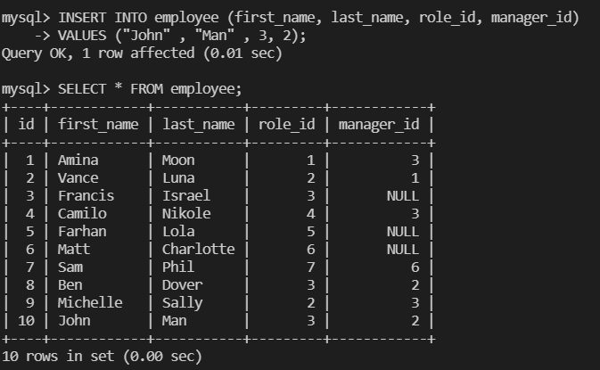
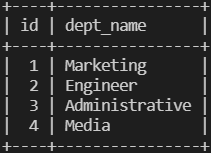
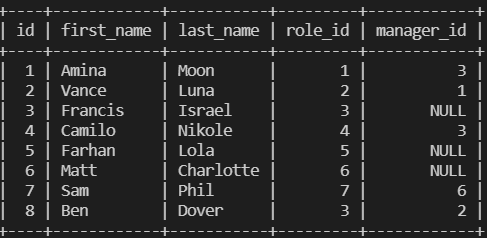
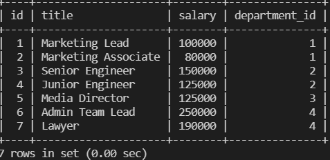

# <h1 align="center"> Employee Tracker MYSQL <h1> 
 ----

## Table of Contents 
- [Description](#description)
- [Installation](#installation)
- [Usage](#usage)
- [Contribution](#contribution)
- [Test Instructions](#test-instructions)
- [Questions](#questions)

----

### Description
This project uses MYSQL, Node.js, Inquirer, and console to create a CMS (content management systems) interface to manage a company's employee database. 

Video Demo [videoDemo](https://watch.screencastify.com/v/NZtHVyWBrTgLUJcrIdS9/.)

----

### Installation 
Node.js, MYSQL, Inquirer, Console.js 
----

### Usage
 node server.js, npm init -y, npm i inquirer, npm i --save mysql2, npm i --save mysql, npm install console.table --save
----

### License

 This application is covered by the MIT License license.
 
----
### Contributing
 n/A
----

### Test-Instructions
no testing required
----

### Questions Find me on GitHub: [Github Profile](https://github.com/Kurdiamina3)

  Email me with any questions: kurdiamina3@gmail.com  

 _This README was generated with by [README-generator] (https://github.com/kurdiamina3/README-generator) 